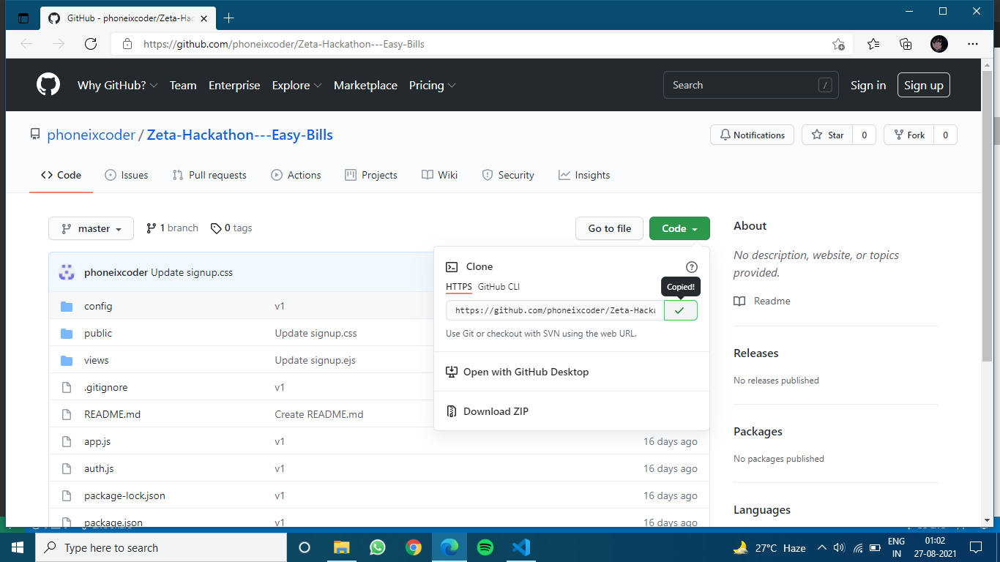
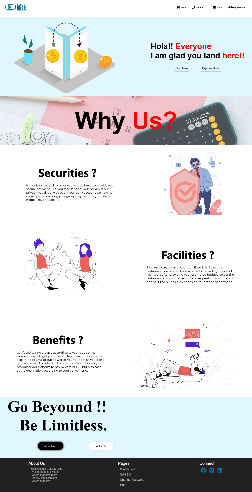
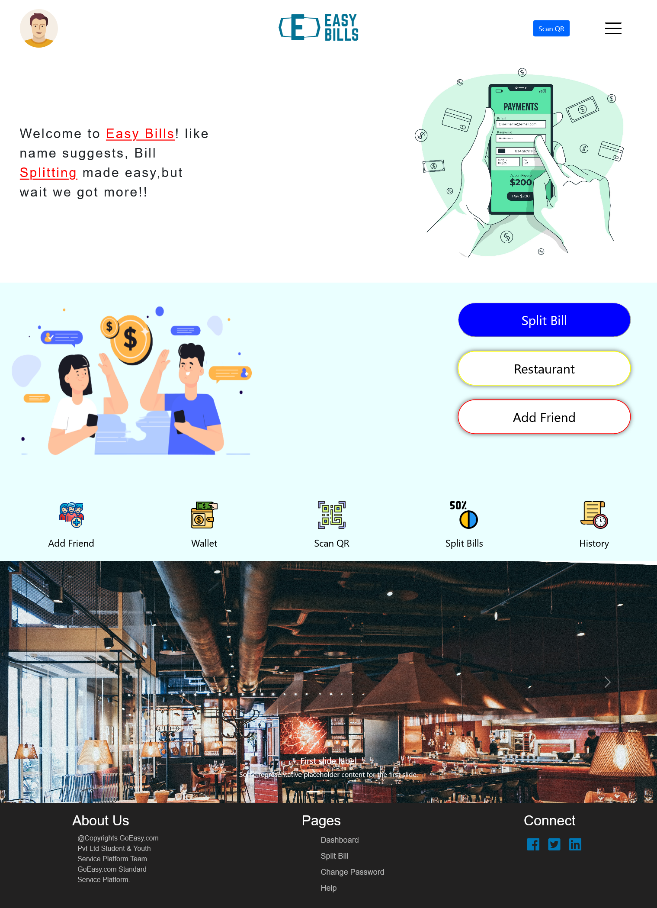
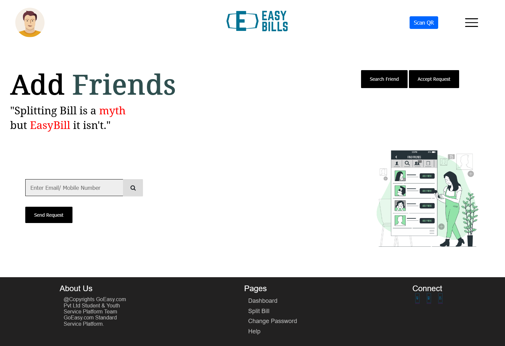
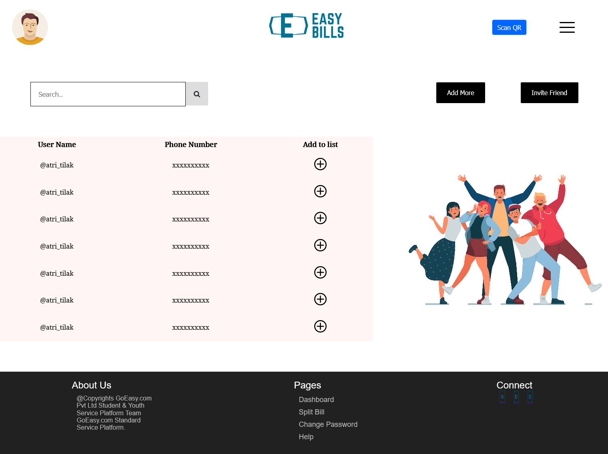

## __Content__

  ### Overview

  ### About

  ### Installations

  ### Tech Stack

  ### API Reference

  ### Screenshots

  ### Introduction Video

  ### Developers

  ### Key Notes

  ### Contribution  

  ### Acknowledgements

  ### Support

  ### Feedback

---------------------------------------------------------------------------------------------------------------

# __EasyBills__

*EasyBills
 can perform various task like Splitting of Bills, 
 fast transaction,Scan & pay,Book a restaurant,etc
  among friends,family and other peoples.*

## __Overview__

Easy Bills is an initiative by four young individuals who have themselves experienced the hassles during the time of payment.
Splitting bills can be a tiring job for everyone but not at Easy Bills. 
We wish to work out the chaotic process one has to go through while splitting bills with their fellowmates. Not only does our idea make it easy for the customer to pay but also for the retailer to receive the payment.

## __About__

> _A friend in need is a friend indeed, But a true friend is one who split bills with you._

We have all faced problems during a group outing about who will pay. We are some young individuals who bring to you this platform where it becomes easy to complete your payments safely. Not only will you get the best restaurant suggestions but also complete transactions hassle-free.
 
### __Security__

Not only do we split bills for your group but also provide you secure payment.
Yes, you read it right! Your privacy is our privacy. Pay directly through your bank account.
So now no more quarrels among your group, payment for your share made Easy and Secure.

### __Benefits__

- Confused to find a place according to your budget, no worries, EasyBills got you covered. Now, search restaurants according to your group as well as your budget so you don’t get overboard.
- Security is taken seriously here.
-  Not only providing you platform to pay by card or UPI but also cash at the destination according to your convenience.

### __Procedure__

- Sign up to create an account on Easy Bills.
- Select the restaurant you wish to book a table for providing the no. of members after providing your estimated budget.
- Select the restaurant and your table no.
- Send requests to your friends and split the bill easily by choosing your mode of payment.

## EasyBills-Features

### Active-Feature
Currently, we provide the bill split feature along with ample privacy because we consider client's privacy as our own. 

### Upcoming-Feature
Well, splitting bills is what we make easy for you but what we provide you extra is suggesting restaurents according to your group's financial estimate. Customer's benefit is our motto.

  
## Installation

Ways to install or run this **EasyBils** on your
machine 

- [x] Download [zip file](https://github.com/phoneixcoder/EasyBills__Final--Submission.git) or Clone the repository [EasyBills](https://github.com/phoneixcoder/EasyBills__Final--Submission.git). 

  - [ ] Clone the repository with https or ssh
    
    

  - [ ] Open Bash/Terminal and run the following  commands

        
        git clone
        
        npm install

  - [ ] Run the Mongod server
        
      `mongod`

      if a db pass is required use
       
       `mongod --dbpath /usr/local/var/log/mongodb`

  - [ ] To see the result in local database or mongo use
      
      `mongo`

      `show database`

      `use database`

  - [ ] start node server
    
    `node app.js`

## Tech Stack 

Technologies used in creating the development environment for easybills. 

**Client:** HTML5, CSS3, Javascript

**Server:** Node.JS, Express.JS, MongoDB

**Package manager** NPM

**IDE:** Visual Studio Code,

## API Reference

API used in EasyBills repository for request and 
response are below mentioned

1. [Creating account holder](https://fusion.tech/docs/ahdc/#create-account-holder) (/newIndividual)

2. [Account holder details](https://fusion.tech/docs/ahdc/#account-holder-details) (/individualByVector)

3. [Issuance of Buddle](https://fusion.tech/docs/bundl/#issuance-of-bundle) (/buddles)

4. [Account balance](https://fusion.tech/docs/acnt/#get-account-balance) (/balance)

5. [A2A](https://fusion.tech/docs/acnt/#account-to-account-transfer) Fund transfer

Consider reading of documentation of [Fusion](https://fusion.tech/cookbooks/integration-and-go-live/) for better understanding.

## Documentation

  - [Nodejs Docs](https://nodejs.org/en/docs/)
  - [Expressjs Docs](https://nodejs.org/en/docs/)
  - [Fusion API Docs](https://fusion.tech/api-references/about-fusion-apis/)
  
## Screenshots

_This is the overview of EasyBills from Clients side.here are some screen shots of web pages_

### Home Page

 

### DashBoard Page

 

### Add Friend Page

 

### Search Friend Page

 
  
## Introduction video

> _Go Beyond limits,_
> _Be limitless_

You can explore and watch a demo or a introductory video of EasyBills here by clicking this : [Click Here](https://youtu.be/otVEMaYrzks)

## __Developers__

 EasyBills Developer Team :

- [Guneet Singh Tuli](https://www.linkedin.com/in/guneetsinghtuli)

- [Tilak Atri](https://www.linkedin.com/in/tilak-a-95705b119)

- [Divyanshi Choudhary](https://www.linkedin.com/in/divyanshi-choudhary-418403205)

- [Himanshu Singh Hada](https://www.linkedin.com/in/himanshu-hada-2b96a41b4)

## Key Notes

- Check all the files are imported perfectly.
- Make sure your machine have nodejs,npm,git installed.  
- Make sure your machine have neccessary setup for EasyBills repository.

## __Contribution__

Note : Currently we are not accepting any kind of contribution in EasyBills

## Acknowledgement

It's been an awesome experience for all the teammate. Zeta's hacathon team were so helpful and, the community they had build brought knowledge to us and created the best engagement experience with all other teams. We had learned so many things throughout this hackathon and we are thankful to zeta for organizing this breathtaking experience for us especially the 24 hours challenge.
  
## 🚀 EasyBills-Team

Team of EasyBills welcome you here!!

## Support

For support, email us on this guneetsinghtuli@gmail.com.
  
## Feedback

If you have any feedback, please reach out to us at himanshuhada380@gmail.com
  
## License

[EasyBills @2022](https://choosealicense.com/licenses/mit/)
